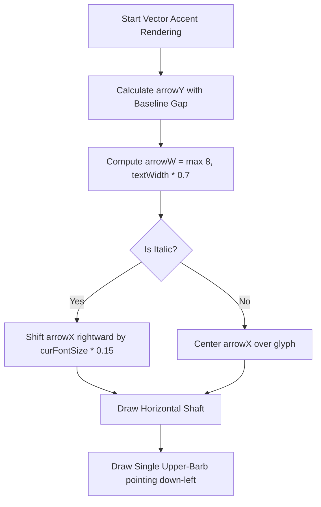

# Mechanics Simulations - Canvas Vector & Math Drawing Guide

This developer guide documents the standardized rules, equations, and helper utilities for drawing LaTeX-quality vector symbols, mathematical labels, and force vectors on HTML Canvas in future mechanics simulations.

---

## 1. Math Typography System (`"KaTeX_Math"`)

To match the look of standard LaTeX/KaTeX typeset equations in the legend, all labels drawn on the HTML Canvas use the authentic KaTeX fonts.

### Font Selection Rule
* **Italic Variables (e.g., $F$, $x$, $v$, $a$, $\theta$)**: Render using `"KaTeX_Math"`, `"KaTeX_Main"`, `serif` with `italic` style.
* **Upright Text/Subscripts/Units (e.g., "app", "net", "kg", "m/s")**: Render using `"KaTeX_Main"`, `"Inter"`, `sans-serif` with standard weight.

### Layout Implementation (`drawUtils.ts`)
The helper function `drawMixedText` dynamically resolves fonts and subscripts per text segment:
```typescript
const getSegFont = (seg: TextSeg) => {
  const size = seg.subscript ? fontSize * 0.75 : fontSize;
  return seg.italic
    ? `italic ${size}px "KaTeX_Math", "KaTeX_Main", serif`
    : `${size}px "KaTeX_Main", "Inter", sans-serif`;
};
```

---

## 2. LaTeX-Style Vector Accent ($\vec{F}$)

Standard canvas text layout engines cannot automatically render combining accents (like the LaTeX vector accent `\vec{}`) correctly. They clip, misalign, or fail to slant with italic characters. 

We manually draw the combining vector accent using canvas stroke paths to guarantee high-DPR crispness and a perfect match to LaTeX standard:



### Key Parameters:
1. **Vertical Offset Gap** (Prevents overlap with character tops, matching standard KaTeX):
   - **Bottom / Alphabetic baseline**: `arrowY = refY - curFontSize * 1.05`
   - **Middle baseline**: `arrowY = refY - curFontSize * 0.65`
   - **Top baseline**: `arrowY = refY - curFontSize * 0.2`
2. **Italic Slant Correction**: If `seg.italic` is true, shift the arrow starting position rightward by `curFontSize * 0.15` (to align with the slant of the KaTeX italic glyph).
3. **Single-Barb Harpoon Shape** (Matches LaTeX standard instead of double barbs):
   - **Upper Barb length**: `curFontSize * 0.18` horizontally, `curFontSize * 0.13` vertically.

### Accent Arrow Stroke Code:
```typescript
// 1. Shaft
ctx.beginPath();
ctx.moveTo(arrowX, arrowY);
ctx.lineTo(arrowX + arrowW, arrowY);
ctx.stroke();

// 2. Head (Single upper barb - harpoon style)
ctx.beginPath();
ctx.moveTo(arrowX + arrowW - curFontSize * 0.18, arrowY - curFontSize * 0.13);
ctx.lineTo(arrowX + arrowW, arrowY);
ctx.stroke();
```

---

## 3. Large Force Vector Arrows

Force, velocity, and acceleration vectors drawn directly in the 1D/2D animation spaces represent real physical quantities. They use bold shafts and solid triangular arrowheads.

### Dynamic Head Size
To ensure that tiny vector arrows (e.g. at low applied forces) do not have their shafts dominated by the arrowhead, head dimensions scale dynamically with shaft length:
```typescript
const headLen = Math.min(absLen * 0.4, Math.max(10, lineWidth * 3.0));
const headHalfWidth = headLen * 0.6;
const shaftEnd = len - direction * headLen;
```

---

## 4. Cohesive Label Spacing & Offsets

To standardise the visual composition, labels placed at the tips of vector arrows must use consistent padding and alignment:

| Vector Direction | `align` | `baseline` | Label Offset (Pixel Coordinate) |
| :--- | :--- | :--- | :--- |
| **Upwards** ($\vec{F}_N$, etc.) | `'center'` | `'bottom'` | `(tip.hx, tip.hy - 12)` |
| **Downwards** ($\vec{F}_g$, etc.) | `'center'` | `'top'` | `(tip.hx, tip.hy + 12)` |
| **Rightwards** ($\vec{F}_{\text{app}}$, etc.) | `'left'` | `'middle'` | `(tip.hx + 12, tip.hy)` |
| **Leftwards** ($\vec{f}$, etc.) | `'right'` | `'middle'` | `(tip.hx - 12, tip.hy)` |

---

## 5. Viewport Boundary Clamping

To prevent animated blocks or bodies from clipping or running off-screen, always measure parent width dynamically in `useEffect` and enforce responsive bounds:

```typescript
// 1. Measure in render/canvas effect
const w = canvas.parentElement!.clientWidth;
sceneWidthRef.current = w;

// 2. Enforce in physics steps (e.g. Friction block scale = 20)
const limitX = Math.max(2.0, (w / 2 - bw / 2 - 20) / scale);
x_new = Math.max(-limitX, Math.min(limitX, x_new));
```

---

## 6. Block Parameter Labeling

To ensure that interactive diagrams remain authentic to physics textbooks, moving blocks and masses drawn on the canvas must be labeled with their mathematical parameter symbols (e.g., $m$, $m_1$, $m_2$) centered perfectly within the body, rather than displaying raw numeric values (like `5.0 kg`). 

### Implementation Guide:
* **Single Block ($m$)**: Center the label at `cy - bh / 2` vertically and `cx` horizontally with `align: 'center'` and `baseline: 'middle'`.
* **Multiple Blocks ($m_1$, $m_2$)**: Center the subscripted labels at the block's vertical midpoint (`cy - b_h / 2`) and horizontal midpoint (`cx_left + b_w / 2`) with `align: 'center'` and `baseline: 'middle'`.

*Example implementation from Newton's 3rd Law:*
```typescript
drawMixedText(ctx, x_left + b_w / 2, cy - b_h / 2,
  [{ text: 'm', italic: true }, { text: '1', subscript: true }],
  { fontSize: 18, color: '#0284c7', align: 'center', baseline: 'middle' });
```
